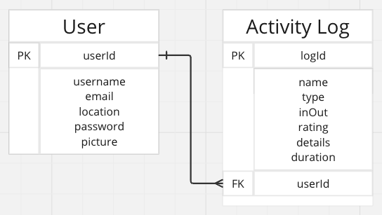
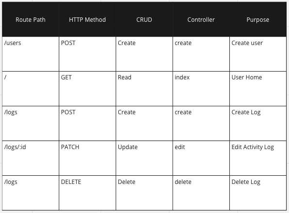
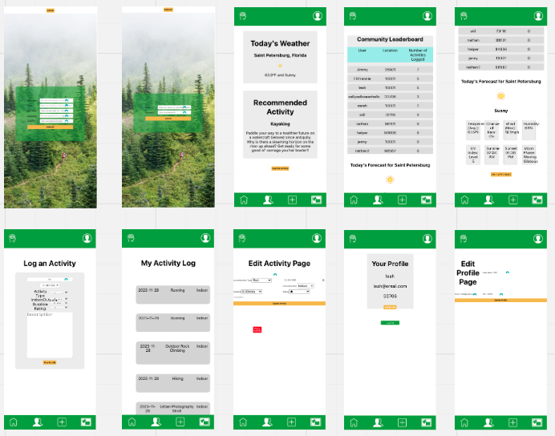

# 
A MERN-Stack application created by [Selam Beyene](https://github.com/Slmbyn), [Will Faulkner](https://github.com/wnfaulkner), [Nathan Holliday](https://github.com/nholliday314), & [Leah Livingston](https://github.com/lvlivingston).

[Click Here to Check out the App Now](https://fitforecast-dc33e66f392f.herokuapp.com/)

---
### **Project Idea and Description**

FITforecast is a web application designed to enhance your well-being through personalized workout suggestions based on your local weather conditions. Whether it's a sunny day and perfect for a run, a rainy afternoon calling for an indoor activity, or a peaceful evening to recharge with meditation, FITforecast tailors a daily workout recommendation for you.

[Click Here to Check out the App Now](https://fitforecast-dc33e66f392f.herokuapp.com/)

---
### **Tech Stack**
It's a MERN-Stack web application hosted on Heroku utilizing MongoDB, Express, React, and Node.js. Also employed with HTML, CSS, and JavaScript, the WeatherAPI is included to provide personalized recommendations.

##### **API Details**
The application utilizes the third-party [WeatherAPI](https://www.weatherapi.com/docs/) (allowing one million calls per month for free). The API's 'forecast' endpoint provides weather forecasts up to three days ahead of the current date, returning useful data like daily average temperature and total expected precipitation.

---
## ERDs

---
### **Restful Routing Chart**

---
### **Screenshots of the App**

###### Landing Page

---
### **Credit**

A big thank you to the team, including our instructors Weston Bailey, Rondell Charles, April Gonzalez & Tom Kolsrud. 

---
### **Next Steps**

###### Style
- [ ] Polish CSS styling following the 'Brand Kit'
- [ ] Increase size of font on 'Log-in' and 'Sign-In' pages
- [ ] Clean up CSS on 'Edit Activity' and 'Edit Profile' screens
- [ ] Include visual optimization for desktop and tablet views
- [ ] Include a carousel view on FITforecast view to see 3-day forecast
- [ ] Include ability for user to include a personalized profile photo

###### Functionality
- [ ] Fix "details" box for 'Edit Activity' page to save update
- [ ] Include ability to log-in via oAuth
- [ ] Include ability for user to upload a photo and bio on their profile page
- [ ] Include ability for user to view analytics like week / month / activity type
- [ ] Include ability for user to delete or archive their profile
- [ ] Include suggestion functionality that takes into account the time of day
- [ ] Include future recommendations based on weather forecast (i.e. out to 'x' number of days)
- [ ] Include current weather via shared location services from user's GPS on their device
- [ ] Include advanced suggested work-outs based on previous performance, ratings, and weather
- [ ] Include additional analytics on dashboard
- [ ] Include ability for all users to add comments under "leaderboard" (like reddit / twitter feed)

---
# Planning Materials & Original Pitch below

### **Project Idea and Description**
A MERN-Stack application created by [Selam Beyene](https://github.com/Slmbyn), [Will Faulkner](https://github.com/wnfaulkner), [Nathan Holliday](https://github.com/nholliday314), & [Leah Livingston](https://github.com/lvlivingston).

FITforecast is a web application designed to enhance your well-being by providing personalized workout suggestions based on your local weather conditions. Whether it's a sunny day perfect for a run, a rainy day calling for indoor exercises, or a peaceful evening ideal for meditation, FITforecast tailors your workout recommendations for you.

---
### **Tech Stack**
It's a MERN-Stack web application hosted on Heroku utilizing MongoDB, Express, React and Node.js. Employed with HTML, CSS, and JavaScript, a weather API is also included.

##### **API Details**

The application will utilize the third-party [WeatherAPI](https://www.weatherapi.com/docs/) which allows 1 Million calls per month for free. The API's 'forecast' endpoint provides weather forecasts up to three days ahead of the current date, returning a slew of data including daily average temperature and total expected precipitation.

---
## ERDs

---
### **Restful Routing Chart**

---
### **Wireframes of your app**
The minimum viable product (MVP) goal is a functional OKR tool with basic CSS styling.

---
### **User Stories**
- [X] AAU, I want the ability to sign-up and create a new profile that includes my location.
- [X] AAU, I want the ability to log-in with an email and password.
- [X] AAU, I want the ability to log-out.
- [X] AAU, I do not want other users to see my activity data.
- [X] AAU, I want the ability to edit my location.
- [X] AAU, I want the application to recommend a work-out based on my location's weather each day.
- [ ] AAU, I want the ability to log my work-out activity, including: date, type, and detailed notes.
- [X] AAU, I want the ability to rate my work-out activity.
- [X] AAU, I want the ability to update and delete my previously logged work-out activity.
- [X] AAU, I want the ability to see a community dashboard that posts the activity total for all users.
- [X] AAU, I want the application to be user-friendly and mobile responsive.

---
### **MVP Goals**

###### Style
- [X] Include basic CSS to successfully utilize the application
- [X] Include bottom navigation including 'Home' page link, 'FITforecast' page link, 'Add Activity' page link, and 'My Activity' page link
- [X] Include top header including the FITforecast logo and a profile icon that links to a profile page
- [X] Include 8 individual page views, including:  'Home' screen, 'FITforecast' screen, 'Add Activity' screen, 'Edit Activity' screen, 'My Activity' screen, 'Edit Activity' screen, 'Profile' screen, and 'Edit Profile' screen
- [X] Include visual optimization for mobile view
- [X] Include a 'Brand Kit' for future development use

###### Functionality
- [X] Include ability to create a new user profile including: username, email, password, and location
- [X] Include a landing page with ability to log-in via email and password
- [X] Include ability for user to log-out
- [X] Include ability for user to view their profile
- [X] Include ability for user to edit their location
- [X] Include functionality that allows each user to only see their own activity 
- [X] Include a weather API that displays the current weather on 'Home' screen and 'FITforecast' screen
- [X] Include current weather based on user's zip code input
- [X] Include a "suggested work-out" based on current weather
- [X] Include ability to log a work-out activity including: name, type, date, indoor v. outdoor, rating, and detail notes
- [X] Include a page that displays all of a user's activity
- [X] Include ability to update a previously logged activity
- [X] Include ability to delete a previously logged activity

---
### **Stretch Goals**

###### Style
- [ ] Include CSS styling following a 'Brand Kit'
- [ ] Include a 'Brand Kit' for future development use
- [ ] Include visual optimization for desktop and tablet
- [ ] Include a carousel view on FITforecast view to see 3-day forecast

###### Functionality
- [X] Include a "leaderboard" of all users ranked in descending order by total activity
- [X] Include functionality that allows all users to see the same dashboard to encourage "friendly competition"
- [ ] Include ability to log-in via oAuth
- [ ] Include ability for user to upload a photo and bio on their profile page
- [ ] Include ability for user to view previous activity by week / month / activity type
- [ ] Include ability for user to delete their profile
- [ ] Include suggestion functionality that takes into account the time of day
- [ ] Include future recommendations based on weather forecast (i.e. out to 'x' number of days)
- [ ] Include current weather via shared location services from user's GPS on their device
- [ ] Include advanced suggested work-outs based on previous performance, ratings, and weather
- [ ] Include additional analytics on dashboard
- [ ] Include ability for all users to add comments under "leaderboard" (like reddit / twitter feed)